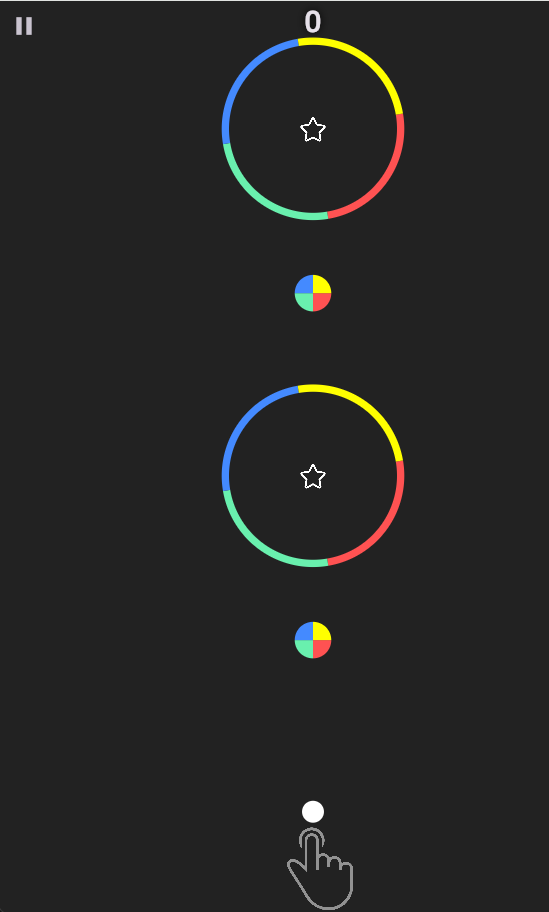

# Color Switch - Flame Game

[](https://flutter.dev/)
[](https://flame-engine.org/)
[](https://opensource.org/licenses/MIT)

Flame oyun motoru ile Flutter'da geliştirilmiş, klasik **Color Switch** mekaniklerine sahip bir 2D mobil oyun.


## 📱 Oyun Hakkında

Oyuncu, sürekli zıplayan bir daireyi kontrol eder. Amacı, dairenin rengini, rotasında karşılaştığı renkli engellerin kendi bölümlerinin rengiyle eşleştirerek ilerlemek ve yıldızları toplamaktır. Renk uyumsuzluğu oyunun sonu demektir!

**Temel Özellikler:**
*   Dokunmatik kontrollü zıplama mekaniği.
*   Rastgele renk değiştiren renk anahtarları (`ColorSwitcher`).
*   Dönen ve renkli dilimlere ayrılmış tekerlek engelleri (`CircleRotator`).
*   Toplanabilir yıldızlar (`StarComponent`) ve parçacık efekti.
*   Skor takibi.
*   Oyun duraklatma/devam ettirme.
*   Ekranda kalan eski nesnelerin temizlendiği (garbage collection) optimizasyonu.
*   Arka plan müziği ve ses efektleri.

## 🎮 Ekran Görüntüleri

> *Buraya oyununuzdan birkaç ekran görüntüsü (screenshot) ekleyin. (Örn: 'assets/screenshots/gameplay1.png')*
> |  Oyun Süreci | 
> |:---:|
> |  | 

## 🚀 Başlangıç

Oyunu kendi makinenizde çalıştırmak için aşağıdaki adımları izleyin.

### Ön Koşullar
*   **Flutter SDK** (v3.0 veya üzeri tavsiye edilir). [Kurulum rehberi için tıklayın.](https://docs.flutter.dev/get-started/install)
*   Bir kod editörü (VS Code veya Android Studio/IntelliJ IDEA tavsiye edilir).
*   Flutter ve Dart eklentilerinin editörünüzde kurulu olması.

### Kurulum
1.  Projeyi bilgisayarınıza klonlayın veya ZIP olarak indirip çıkarın.
    ```bash
    git clone https://github.com/yarenibis/color_switch.git
    cd color_switch
    ```
2.  Proje bağımlılıklarını yükleyin.
    ```bash
    flutter pub get
    ```
3.  Projeyi bir cihazda (telefon/tablet) veya emülatör/simülatör'de çalıştırın.
    ```bash
    flutter run
    ```

## 📁 Proje Yapısı ve Kod Açıklaması


### Önemli Sınıflar:
*   **`MyGame` (FlameGame)**: Oyun döngüsünü, kamerayı, sesleri, skoru ve yeni nesnelerin üretimini yönetir. `_tryToGarbageCollect` metodu ile performansı optimize eder.
*   **`Player`**: Yerçekimi ve zıplama fiziklerini (`_velocity`, `_gravity`) içerir. `CollisionCallbacks` ile diğer nesnelerle etkileşime girer.
*   **`CircleRotator` & `CircleArc`**: `RotateEffect` ile dönen, her bir dilimi (`sweepAngle`) ayrı renkte ve `PolygonHitbox` ile hassas çarpışma algılaması olan engeller.
*   **`ColorSwitcher`**: Oyuncuyla çarpıştığında onun rengini `gameRef.gameColors` listesinden rastgele bir renkle değiştirir.
*   **`StarComponent`**: Toplandığında `ParticleSystemComponent` kullanarak hoş bir parçacık efekti gösterir ve skoru artırır.


